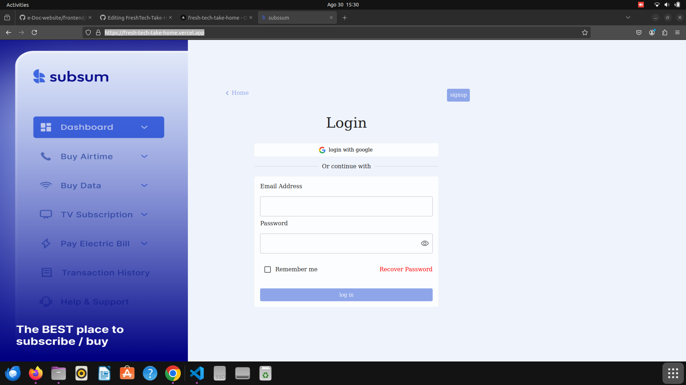
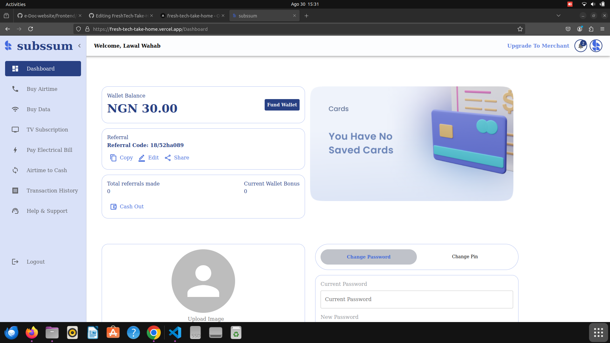
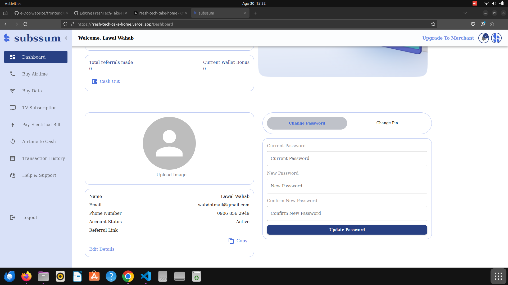
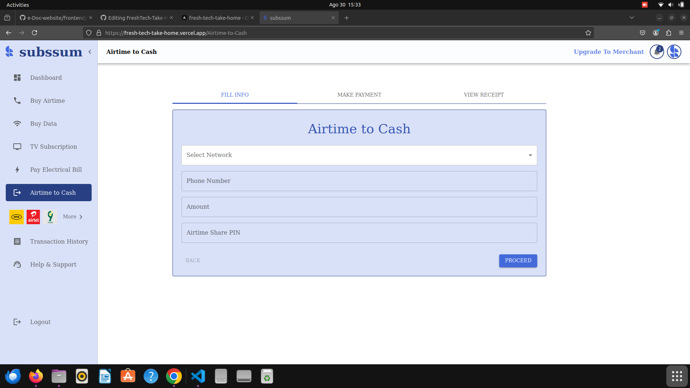
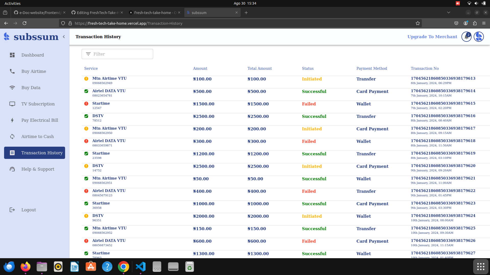
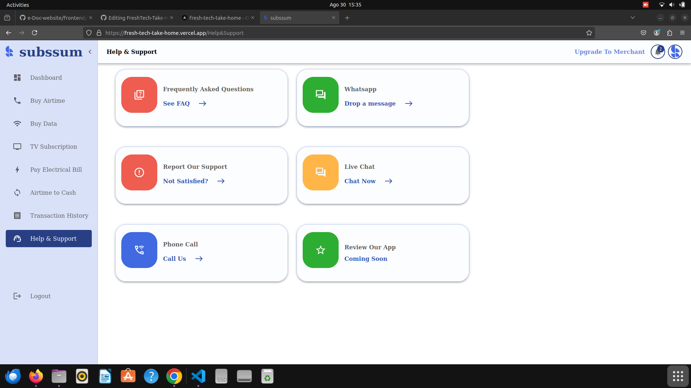

# FreshTech Take-Home Project

## Overview

This repository contains the frontend implementation for the FreshTech take-home assignment. The task was to develop a series of screens as described in the provided Figma design. The project uses React.js, React Router DOM, and Material UI.

## Screenshots

- Log in page 
- Dashboard page 
 

- Airtime to Cash page 
- Transaction Page 
- Help and Support Page 

## Installation

To get started with the project locally, follow these steps:

1. **Clone the Repository:**

   ```bash
   git clone https://github.com/yourusername/freshtech-take-home.git
   ```

2. **Navigate to the Project Directory:**

   ```bash
   cd freshtech-take-home/client
   ```

3. **Install Dependencies:**

   ```bash
   npm install
   ```

4. **Start the Development Server:**

   ```bash
   npm start
   ```

   The application will be available at `http://localhost:3000`.

## Technologies Used

- **React.js**: JavaScript library for building user interfaces.
- **React Router DOM**: For routing and navigation.
- **Material UI**: For component styling and theming.
- **Vercel**: For hosting the application.

## Hosted Application

You can view the hosted version of the application at the following link:

- [FreshTech Take-Home - Vercel](https://fresh-tech-take-home.vercel.app/)
- just click login since there's no authentication

## Task Instructions

1. **Role**: Frontend Developer
2. **Task**: Use React.js to code the screens from the provided Figma link.
3. **Submission**: Submit your work via this README by including your hosted link and all necessary materials for review on or before 31st August, 2024.

## Figma Design

The Figma design for the project can be found here:

- [Figma Design Link](https://www.figma.com/design/lTqNuerHmDsU6FMOWiFHmC/SUBSSUM-EXTRACT?node-id=0-1&t=EwRR9CMcvxTcbxDF-1)

## Questions

If you have any further questions or need clarifications, feel free to ask.

Thank you for considering my application. I look forward to the next steps.

